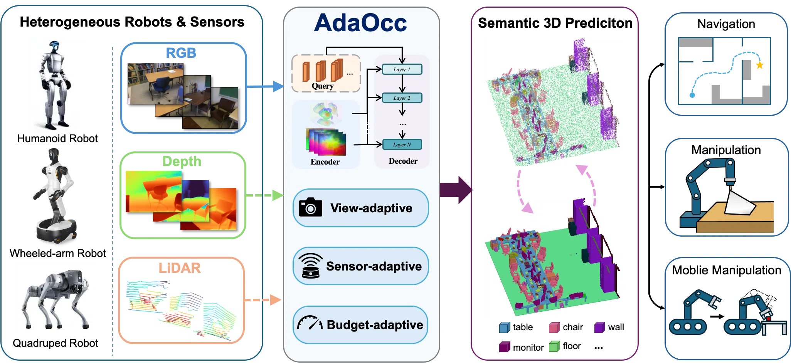

<div align="center">

<h1>AdaOcc: Adaptive 3D Occupancy Prediction for Embodied Tasks</h1>

<p>
Jinglong Wang<sup>1,2</sup> &nbsp; Yunjie Wang<sup>2,3</sup> &nbsp; Zhiyang Zhang<sup>1,2</sup> &nbsp;
Jiawei He<sup>2,4</sup> &nbsp; Ye Yuan<sup>5</sup> &nbsp; Bo Qiu<sup>6</sup> &nbsp; Jing Zhang<sup>1</sup>
<br>
<sup>1</sup>Beihang University &nbsp; <sup>2</sup>Beijing Academy of Artificial Intelligence &nbsp;
<sup>3</sup>Hebei University of Technology &nbsp; <sup>4</sup>XYZ Embodied AI &nbsp;
<sup>5</sup>ShanghaiTech University &nbsp; <sup>6</sup>University of Science and Technology Beijing
</p>

<p>
<a href="https://arxiv.org/abs/2609.38864"></a>
<a href="https://wangjl-nb.github.io/AdaOcc_web/"></a>
<a href="https://huggingface.co/wjldragon/AdaOcc"></a>

</p>

🎉 **Accepted to NeurIPS 2026.** Paper: [arXiv:2609.38864](https://arxiv.org/abs/2609.38864). See the [project page](https://wangjl-nb.github.io/AdaOcc_web/) for videos and real-robot demos, and [Hugging Face](https://huggingface.co/wjldragon/AdaOcc) for released checkpoints.

</div>

<p align="center">
  
</p>

AdaOcc is a point-based adaptive 3D semantic occupancy framework for embodied scene understanding. This public repository contains code, data-preparation scripts, and reproduction docs for the OccScanNet-mini setup and for the released OccScanNet full-split checkpoint.

If you are using an AI agent to reproduce AdaOcc, point it to [`docs/AI_REPRODUCTION.md`](docs/AI_REPRODUCTION.md).

RADIO remains the released/reference baseline. EfficientNet-B7 additional option support is available through a separate config-selected image encoder path; no released EfficientNet-B7 metric claim is made here. The default depth mode is local/prepared same-stem `posed_images/<scene>/<frame>.png` (`ADAOCC_ONLINE_DEPTH=0`, `ADAOCC_RAW_DEPTH_FROM_IMAGES=1`), not online prediction.

This repo does not redistribute OccScanNet data, pretrained weights, trained checkpoints, generated labels, generated depth files, logs, or private artifacts.

## Released result

Checkpoints and release files: <https://huggingface.co/wjldragon/AdaOcc>

Released RADIO AdaOcc checkpoints:

| checkpoint | split | epoch | mIoU | IoU |
| --- | --- | ---: | ---: | ---: |
| `checkpoints/adaocc_online_depth_occscannet_mini_epoch200.pth` | OccScanNet-mini | 200 | 58.49 | 65.49 |
| `checkpoints/adaocc_radio_occscannet_full_epoch100.pth` | OccScanNet full | 100 | 59.67 | 65.29 |

Released RADIO online-depth epoch-200 OccScanNet-mini validation result:

| mIoU | IoU | ceiling | floor | wall | window | chair | bed | sofa | table | tvs | furniture | objects |
| :---: | :---: | :---: | :---: | :---: | :---: | :---: | :---: | :---: | :---: | :---: | :---: | :---: |
| 58.49 | 65.49 | 47.80 | 57.61 | 56.41 | 48.26 | 59.09 | 75.04 | 75.29 | 57.78 | 43.56 | 64.60 | 57.99 |

Expected reproduction tolerance is about ±0.5 for `mIoU` / `IoU`. See [`docs/REPRODUCIBILITY.md`](docs/REPRODUCIBILITY.md).

Evaluate the released checkpoint:

```bash
ADAOCC_ONLINE_DEPTH=1 \
./dist_val.sh 8 configs/occscannet/radio_occscannet_mini.py \
  checkpoints/adaocc_online_depth_occscannet_mini_epoch200.pth
```

Evaluate the released full-split checkpoint on OccScanNet full validation (the config defaults to the generated precomputed depth used by the released run):

```bash
./dist_val.sh 8 configs/occscannet/radio_occscannet_full.py \
  checkpoints/adaocc_radio_occscannet_full_epoch100.pth
```

## 1. Prepare OccScanNet

Prepare or symlink OccScanNet at `data/OccScanNet` and see [`docs/DATA.md`](docs/DATA.md).

```bash
mkdir -p data
ln -s /path/to/OccScanNet data/OccScanNet
```

Minimum starting data layout:

```text
data/OccScanNet/
├── train_subscenes.txt
├── val_subscenes.txt
├── gathered_data/
│   └── <scene>/
│       └── <frame>.pkl
└── posed_images/
    └── <scene>/
        ├── <frame>.jpg
        └── <frame>.png
```

## 2. Download weights and checkpoints

Place pretrained/external weights under `pretrain/`. `checkpoints/` means user-provided or released trained AdaOcc model checkpoints.

| asset | source | target |
| --- | --- | --- |
| OccScanNet | <https://huggingface.co/datasets/hongxiaoy/OccScanNet> | `data/OccScanNet/` |
| RADIO | <https://huggingface.co/nvidia/C-RADIOv3-B> | `pretrain/radio/C-RADIOv3-B/` |
| EfficientNet-B7 weight file | <https://github.com/rwightman/pytorch-image-models/releases/download/v0.1-weights/tf_efficientnet_b7_ns-1dbc32de.pth> | `pretrain/timm/tf_efficientnet_b7_ns-1dbc32de.pth` |
| Depth-Anything FT checkpoint, optional for online/generated depth | <https://huggingface.co/YkiWu/EmbodiedOcc/blob/main/finetune_scannet_depthanythingv2.pth> | `pretrain/depth_anything/finetune_scannet_depthanythingv2.pth` |
| AdaOcc fusion pretrain | <https://huggingface.co/wjldragon/AdaOcc/blob/main/pretrain/fusion_pretrain_model.pth> | `pretrain/fusion_pretrain_model.pth` |
| Released AdaOcc mini checkpoint | <https://huggingface.co/wjldragon/AdaOcc/blob/main/checkpoints/adaocc_online_depth_occscannet_mini_epoch200.pth> | `checkpoints/adaocc_online_depth_occscannet_mini_epoch200.pth` |
| Released AdaOcc full-split checkpoint | <https://huggingface.co/wjldragon/AdaOcc/blob/main/checkpoints/adaocc_radio_occscannet_full_epoch100.pth> | `checkpoints/adaocc_radio_occscannet_full_epoch100.pth` |

```bash
hf download wjldragon/AdaOcc \
  pretrain/fusion_pretrain_model.pth \
  checkpoints/adaocc_online_depth_occscannet_mini_epoch200.pth \
  checkpoints/adaocc_radio_occscannet_full_epoch100.pth \
  --local-dir .

hf download nvidia/C-RADIOv3-B --local-dir pretrain/radio/C-RADIOv3-B

mkdir -p pretrain/timm
wget -O pretrain/timm/tf_efficientnet_b7_ns-1dbc32de.pth \
  https://github.com/rwightman/pytorch-image-models/releases/download/v0.1-weights/tf_efficientnet_b7_ns-1dbc32de.pth
```

Expected downloaded project layout:

```text
AdaOcc/
├── data/
│   └── OccScanNet/
├── pretrain/                         # external/pretrained weights and initializers
│   ├── fusion_pretrain_model.pth
│   ├── radio/
│   │   └── C-RADIOv3-B/
│   ├── timm/
│   │   └── tf_efficientnet_b7_ns-1dbc32de.pth
│   └── depth_anything/               # optional unless using online/generated depth
│       └── finetune_scannet_depthanythingv2.pth
└── checkpoints/                      # trained AdaOcc model checkpoints
    ├── adaocc_online_depth_occscannet_mini_epoch200.pth
    └── adaocc_radio_occscannet_full_epoch100.pth
```

See [`docs/LICENSE_AND_ASSETS.md`](docs/LICENSE_AND_ASSETS.md) for asset routes, license notes, and OPUS-derived fusion-pretrain details.

## 3. Install

```bash
conda env create -f environment.yml
conda activate AdaOcc
python -m pip install "setuptools<81" wheel "numpy==1.26.4" "packaging==24.2" "PyYAML>=6.0" ninja
python -m pip install --no-build-isolation -r requirements.txt
python -m pip check
```

The custom MSMV CUDA extension is optional for these public configs. If it is not built or unavailable, set `ADAOCC_DISABLE_MSMV_CUDA` to `1` on the affected command to use the PyTorch fallback. If you build the extension, set `TORCH_CUDA_ARCH_LIST` for your GPU, for example:

```bash
cd models/csrc
TORCH_CUDA_ARCH_LIST="9.0" MAX_JOBS=8 CUDA_HOME="$CONDA_PREFIX" CUDA_PATH="$CONDA_PREFIX" \
  python setup.py build_ext --inplace
cd ../..
```

See [`docs/INSTALL.md`](docs/INSTALL.md) for tested versions and CUDA-extension troubleshooting.

## 4. Generate data files

Mini baseline PKLs:

```bash
python scripts/generate_occscannet_mini_pkls.py --data-root data/OccScanNet --overwrite
python scripts/generate_occscannet_mini_gts_camvisbits.py --data-root data/OccScanNet --overwrite
python scripts/generate_occscannet_mini_gts_camvisbits.py --data-root data/OccScanNet --verify-only
python scripts/check_assets.py --radio --raw-depth-from-images --verify-depth-png
```

Full-split PKLs for `configs/occscannet/radio_occscannet_full.py` (the same source images, but indexing every entry in `train_subscenes.txt` / `val_subscenes.txt`):

```bash
python scripts/generate_occscannet_mini_pkls.py \
  --data-root data/OccScanNet \
  --train-count 0 --val-count 0 \
  --train-output train_occscannet_full.pkl \
  --val-output val_occscannet_full.pkl \
  --test-output test_occscannet_full.pkl \
  --overwrite
```

The label and depth generators default to the mini PKLs, so select the full-split PKLs explicitly for the full checkpoint. Both generated trees are shared, so this also covers the mini frames:

```bash
python scripts/generate_occscannet_mini_gts_camvisbits.py \
  --data-root data/OccScanNet \
  --splits train_occscannet_full.pkl val_occscannet_full.pkl test_occscannet_full.pkl \
  --overwrite

python scripts/generate_occscannet_mini_depth_da_v2.py \
  --data-root data/OccScanNet \
  --weights pretrain/depth_anything/finetune_scannet_depthanythingv2.pth \
  --splits train_occscannet_full.pkl val_occscannet_full.pkl test_occscannet_full.pkl

python scripts/check_assets.py --radio --precomputed-depth --verify-depth-png \
  --splits train_occscannet_full.pkl val_occscannet_full.pkl test_occscannet_full.pkl
```

Optional generated precomputed-depth mode:

```bash
python scripts/generate_occscannet_mini_depth_da_v2.py \
  --data-root data/OccScanNet \
  --weights pretrain/depth_anything/finetune_scannet_depthanythingv2.pth
python scripts/generate_occscannet_mini_depth_da_v2.py --data-root data/OccScanNet --verify-only
python scripts/check_assets.py --radio --precomputed-depth --verify-depth-png
```

Use `--efficientnet-b7` instead of `--radio` when checking the EfficientNet-B7 asset. Use `--online-depth` when checking the optional online Depth-Anything checkpoint.

Verify that a downloaded checkpoint loads into its public config before running evaluation:

```bash
python scripts/check_checkpoint.py \
  --config configs/occscannet/radio_occscannet_mini.py \
  --checkpoint checkpoints/adaocc_online_depth_occscannet_mini_epoch200.pth

python scripts/check_checkpoint.py \
  --config configs/occscannet/radio_occscannet_full.py \
  --checkpoint checkpoints/adaocc_radio_occscannet_full_epoch100.pth
```

## 5. Choose config, depth mode, and run

### 5.1 Choose image encoder by config path

Pass the config path directly to `dist_train.sh` / `dist_val.sh`.

| choice | full config | smoke config | extra asset |
| --- | --- | --- | --- |
| RADIO released/reference baseline (OccScanNet-mini) | `configs/occscannet/radio_occscannet_mini.py` | `configs/occscannet/radio_occscannet_mini_smoke.py` | `pretrain/radio/C-RADIOv3-B/` |
| RADIO released full-split checkpoint (OccScanNet full) | `configs/occscannet/radio_occscannet_full.py` | — | `pretrain/radio/C-RADIOv3-B/` |
| EfficientNet-B7 additional option | `configs/occscannet/efficientnet_b7_occscannet_mini.py` | `configs/occscannet/efficientnet_b7_occscannet_mini_smoke.py` | `pretrain/timm/tf_efficientnet_b7_ns-1dbc32de.pth` |

RADIO is the released/reference baseline. `radio_occscannet_full.py` is the full-split companion of the RADIO mini baseline and uses the same model class and hyperparameters apart from the data split, the progressive-query schedule, and the default depth mode. EfficientNet-B7 is an additional config-selected image encoder option and has no released metric claim here.

### 5.2 Choose depth mode

- Default local/prepared depth: no depth env prefix; uses local same-stem `posed_images/<scene>/<frame>.png` files, not online prediction.
- Online predicted depth: prefix the command with `ADAOCC_ONLINE_DEPTH=1` and provide `pretrain/depth_anything/finetune_scannet_depthanythingv2.pth`.
- Generated precomputed depth: after generating `depth_splatssc_stage1_ftdav2_vitb_20m_full/`, prefix the command with `ADAOCC_RAW_DEPTH_FROM_IMAGES=0`.
- `configs/occscannet/radio_occscannet_full.py` already defaults to generated precomputed depth (`ADAOCC_RAW_DEPTH_FROM_IMAGES=0`), so the released full-split checkpoint evaluates with no depth env prefix. Set `ADAOCC_RAW_DEPTH_FROM_IMAGES=1` to override it.
- Use the same config path and depth-mode switch for train/eval of a given checkpoint.

### 5.3 Optional MSMV fallback

If the optional MSMV CUDA extension is not built or unavailable, set `ADAOCC_DISABLE_MSMV_CUDA` to `1` on that command to use the PyTorch fallback. Do not add it to every command by default.

```bash
ADAOCC_DISABLE_MSMV_CUDA=1 \
./dist_train.sh 8 configs/occscannet/radio_occscannet_mini_smoke.py \
  --run-label smoke-radio
```

### 5.4 Final expected layout

```text
data/OccScanNet/
├── train_occscannet_mini.pkl        # generated PKLs
├── val_occscannet_mini.pkl
├── test_occscannet_mini.pkl
├── train_occscannet_full.pkl        # generated full-split PKLs
├── val_occscannet_full.pkl
├── test_occscannet_full.pkl
├── gts_camvisbits/<scene>/<frame>/labels.npz
├── posed_images/<scene>/<frame>.{jpg,png}
└── depth_splatssc_stage1_ftdav2_vitb_20m_full/<scene>/<frame>.png   # optional generated precomputed depth
pretrain/                                         # external/pretrained weights/initializers
├── fusion_pretrain_model.pth
├── radio/C-RADIOv3-B/
├── timm/tf_efficientnet_b7_ns-1dbc32de.pth
└── depth_anything/finetune_scannet_depthanythingv2.pth   # optional online/generated-depth initializer
checkpoints/                                      # trained AdaOcc model checkpoints
├── adaocc_online_depth_occscannet_mini_epoch200.pth
└── adaocc_radio_occscannet_full_epoch100.pth
outputs/
```

### 5.5 Smoke, train, and eval examples

RADIO smoke:

```bash
./dist_train.sh 8 configs/occscannet/radio_occscannet_mini_smoke.py \
  --run-label smoke-radio
```

EfficientNet-B7 smoke:

```bash
./dist_train.sh 8 configs/occscannet/efficientnet_b7_occscannet_mini_smoke.py \
  --run-label smoke-efficientnet-b7
```

Default local/prepared-depth RADIO training and evaluation:

```bash
./dist_train.sh 8 configs/occscannet/radio_occscannet_mini.py \
  --run-label radio-raw-depth-mini

./dist_val.sh 8 configs/occscannet/radio_occscannet_mini.py /path/to/epoch_200.pth
```

Default local/prepared-depth EfficientNet-B7 training and evaluation:

```bash
./dist_train.sh 8 configs/occscannet/efficientnet_b7_occscannet_mini.py \
  --run-label efficientnet-b7-raw-depth-mini

./dist_val.sh 8 configs/occscannet/efficientnet_b7_occscannet_mini.py /path/to/epoch_200.pth
```

Online predicted-depth RADIO evaluation:

```bash
ADAOCC_ONLINE_DEPTH=1 \
./dist_val.sh 8 configs/occscannet/radio_occscannet_mini.py \
  checkpoints/adaocc_online_depth_occscannet_mini_epoch200.pth
```

Generated precomputed-depth RADIO training and evaluation after generating `depth_splatssc_stage1_ftdav2_vitb_20m_full/`:

```bash
ADAOCC_RAW_DEPTH_FROM_IMAGES=0 \
./dist_train.sh 8 configs/occscannet/radio_occscannet_mini.py \
  --run-label radio-precomputed-depth-mini

ADAOCC_RAW_DEPTH_FROM_IMAGES=0 \
./dist_val.sh 8 configs/occscannet/radio_occscannet_mini.py /path/to/epoch_200.pth
```

Released full-split RADIO checkpoint evaluation (the config defaults to generated precomputed depth):

```bash
./dist_val.sh 8 configs/occscannet/radio_occscannet_full.py \
  checkpoints/adaocc_radio_occscannet_full_epoch100.pth
```

Full-split RADIO training (100 epochs, 200 -> 500 queries):

```bash
./dist_train.sh 8 configs/occscannet/radio_occscannet_full.py \
  --run-label radio-full-split
```

## More docs

- [`docs/AI_REPRODUCTION.md`](docs/AI_REPRODUCTION.md): command-oriented AI-agent reproduction guide
- [`docs/INSTALL.md`](docs/INSTALL.md): environment and optional CUDA extension notes
- [`docs/DATA.md`](docs/DATA.md): PKLs, labels, raw-depth defaults, and generated-depth format
- [`docs/REPRODUCIBILITY.md`](docs/REPRODUCIBILITY.md): smoke/full reproduction checklist and reference metrics
- [`docs/ARCHITECTURE.md`](docs/ARCHITECTURE.md): image encoders, depth paths, TPV, and query schedule
- [`docs/LICENSE_AND_ASSETS.md`](docs/LICENSE_AND_ASSETS.md): upstream assets, licenses, and citations
- [`docs/DEPENDENCY_TRACE.md`](docs/DEPENDENCY_TRACE.md): major code-module map

Please cite/acknowledge OccScanNet, ScanNet, CompleteScanNet/SCFusion, OPUS, SPlatSSC, Depth Anything V2, and RADIO according to their licenses.

## Citation

If you find AdaOcc useful in your research, please consider citing our paper.

```bibtex
@inproceedings{wang2026adaocc,
  title     = {AdaOcc: Adaptive 3D Occupancy Prediction for Embodied Tasks},
  author    = {Wang, Jinglong and Wang, Yunjie and Zhang, Zhiyang and
               He, Jiawei and Yuan, Ye and Qiu, Bo and Zhang, Jing},
  booktitle = {Advances in Neural Information Processing Systems},
  volume    = {39},
  year      = {2026},
  note      = {Accepted to NeurIPS 2026},
  url       = {https://arxiv.org/abs/2609.38864}
}
```

This entry is valid now and will be updated with the official proceedings key, pages, and URL once the NeurIPS 2026 proceedings are published.
